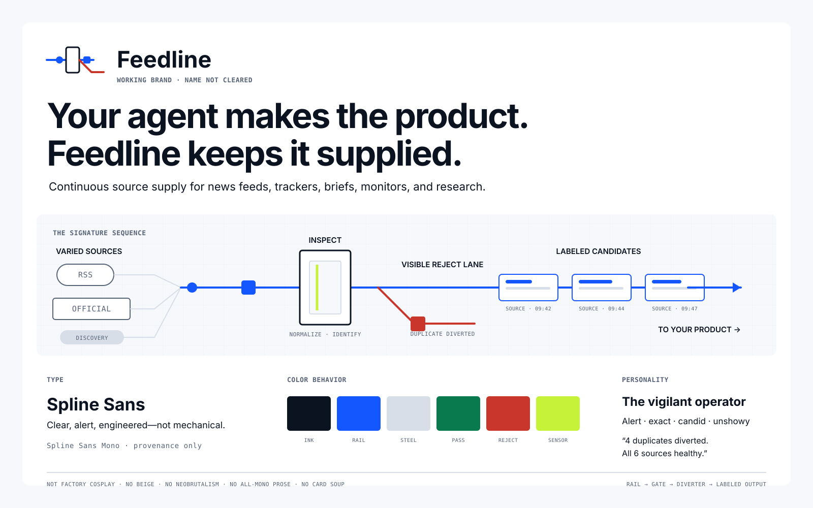

# Feedline brand system

> **Status:** Working brand direction, ready for founder review. `Feedline` has not been legally cleared and should not replace package names, API paths, or repository identity yet.

## The product truth

Feedline continuously turns varied external sources into fresh, normalized, deduplicated, provenance-carrying candidate supply for agents and applications.

It exists because every consuming product was otherwise rebuilding and maintaining the same invisible machinery: source registration, feed polling, provider calls, scheduling, retries, deduplication, freshness checks, and health monitoring.

Feedline supplies raw material. The consuming agent remains responsible for interpretation, ranking, writing, workflow, and publication.

### What people can make with it

| Hero | Finished product | Material entering Feedline | What comes off the line |
|---|---|---|---|
| News product builder | A continuously refreshed vertical news feed | Publisher feeds, official sources, bounded discovery | Fresh candidate stories with provenance |
| Market-intelligence agent | A competitor or sector tracker | Company blogs, filings, industry sources, search discovery | New evidence since the last run |
| Policy team | A regulatory watch product | Government feeds, official pages, bounded web discovery | Traceable policy candidates and source health |
| Creator | A daily or weekly briefing | A chosen source set plus discovery queries | Deduplicated items ready for selection and commentary |
| Research agent | A recurring research stream | Feeds and provider results | One neutral evidence contract instead of provider-specific responses |
| Internal operator | A risk or opportunity monitor | Known operational sources and targeted discovery | A dependable incremental queue for downstream workflows |

The common product is not search. It is an operated supply line that keeps these products fed.

## The dramatic story

### Hero

The creator or their agent. They want to make the finished product: the news experience, tracker, brief, monitor, or research workflow.

### Villain: the Feedline Trap

Every recurring information product needs a source-supply operation. Without Feedline, the hero faces a false choice:

1. build and maintain a second product behind the product—the ingestion line; or
2. neglect it until sources fail, duplicates accumulate, freshness disappears, and the finished product runs dry.

The villain is not “too much information.” It is the permanent operational burden of keeping useful material moving.

### Failure mode: the jam

The line silently stalls. A source fails. The same items circle back. Empty results look like “nothing happened.” The agent keeps working from stale or repetitive material while nobody can see where supply broke.

### Ally

Feedline operates the line: intake, collection, normalization, deduplication, provenance, retries, and health.

### Victory

The hero describes what material the product needs, receives an incremental candidate supply, and spends time on the product only they can make.

## The core metaphor: an optical sorting line

Use the operating logic of a modern sorting line, not the visual costume of a factory.

| Feedline behavior | Visual behavior |
|---|---|
| Feeds and discovery enter | Different source capsules join one continuous rail |
| Collection runs repeatedly | Material advances in a calm, steady direction |
| Candidates are inspected and normalized | A precise scanning gate reads each item |
| Duplicates and failures are removed | A diverter sends rejected material to a visible side lane |
| Provenance remains attached | A compact origin label travels with every candidate |
| Health is observable | Gaps, jams, and degraded sources are visible on the line |
| Agents consume neutral candidates | Clean, labeled material exits toward the hero's product |

The most ownable visual sequence is **rail → inspection gate → diverter → labeled output**. It should remain recognizable without the wordmark.

### What the metaphor must not imply

- Feedline does not decide truth, importance, or editorial value.
- Passing inspection means structurally usable and traceable, not factually endorsed.
- A rejected lane represents duplicates, failures, or incomplete material—not ideological judgment.
- The finished news product, report, or insight belongs to the hero and should appear beyond the line, never inside Feedline.

## Personality: the vigilant line operator

Feedline behaves like a skilled operator who keeps material moving and tells you exactly what happened.

### Temperament

- **Alert:** notices stalls, gaps, and degradation early.
- **Exact:** preserves identity, timing, provenance, and failure state.
- **Candid:** never turns an empty or failed run into false confidence.
- **Unshowy:** does the operational work without pretending to be the creator.

### Behaviors

- In success: “18 new candidates. 4 duplicates diverted. All 6 sources healthy.”
- In uncertainty: “Two candidates are incomplete. Provenance is intact; extraction was partial.”
- In failure: “The policy source has not delivered in 9 hours. The rest of the line is moving.”
- At the boundary: “Feedline supplies candidates. Your agent decides what matters.”

### Refusals

Feedline never claims to think, know what matters, publish, replace editorial judgment, or make unsupported source material reliable merely by collecting it.

## Positioning

### Category

Continuous source supply for agents and applications.

### One-line truth

Feedline keeps your product supplied with fresh, usable source candidates.

### Primary promise

**Your agent makes the product. Feedline keeps it supplied.**

### Supporting lines

- Build what comes off the line.
- The feedline you do not have to maintain.
- Raw sources in. Usable candidates out.
- Keep the feed moving.
- Search gives you a pile. Feedline gives you a supply line.
- Know when the line is moving—and where it is not.

### Recommended landing hierarchy

1. **Headline:** Your agent makes the product. Feedline keeps it supplied.
2. **Explanation:** Describe the material once. Feedline continuously collects, normalizes, deduplicates, labels, and monitors it.
3. **Boundary:** Your agent still decides what matters and what to make.
4. **Mechanism visual:** raw inputs → inspection → reject lane → labeled candidates → finished products
5. **Use cases:** news feeds, trackers, briefs, monitors, and recurring research
6. **Comparison:** search result versus operated incremental supply
7. **Proof:** source health, provenance, provider choice, API/MCP, self-hosting

## Voice

Use direct, concrete sentences. Prefer operational verbs: enter, inspect, divert, label, move, stall, resume, supply. Use numbers and states when evidence exists.

The voice is quietly confident, not breathless. It can use the line metaphor sparingly, but must never turn every sentence into machinery wordplay.

| Prefer | Avoid |
|---|---|
| “3 sources need attention.” | “Something magical is happening behind the scenes.” |
| “No new candidates since 08:10.” | “No news is good news.” |
| “Build a recurring source supply.” | “Unlock next-generation AI-powered intelligence.” |
| “Your agent decides what matters.” | “Feedline finds the truth for you.” |

## Naming decision

`Feedline` is the working public brand because it names the essential thing users need but should not have to operate themselves. It also stretches naturally across feeds, trackers, briefs, monitors, and research.

It is not yet a cleared final name. Current collision research found existing company and trademark use, including a recent European trademark application. Before public renaming:

1. commission a proper trademark and company-name clearance in target markets;
2. check domains, package registries, social handles, and search confusion;
3. decide whether `Feedline` is the company/product name or a product layer under SourceFoundry;
4. keep `SourceFoundry` in code and API identity until that decision is complete.

The working collision check used public company and trademark indexes, including [Feedline Communications Private Limited](https://www.zaubacorp.com/FEEDLINE-COMMUNICATIONS-PRIVATE-LIMITED-U72200DL1996PTC079874) and [EU application 019394914](https://www.trademarkelite.com/europe/trademark/trademark-detail/019394914/FEEDLINE). These are warning signals, not a legal opinion.

## Rejected territories

- **Foundry / forge:** communicates transformation but implies heat, craft, and finished creation. It makes the product feel like the maker rather than the supplier.
- **River / stream:** expresses continuity but hides inspection, deduplication, provenance, and operational maintenance.
- **Pantry / ingredients:** expresses raw material but feels static and domestic; it does not convey recurring supply or line health.
- **Newswire / newsroom:** overfits the original news use case and weakens tracker, research, policy, and internal-monitoring use cases.
- **Literal factory:** hazard stripes, steel textures, rivets, and industrial cosplay make the identity heavy and gimmicky instead of precise and useful.

## Brand guardrails

- Hero first: show the finished product the agent can make, not Feedline admiring its own machinery.
- Mechanism before decoration: every distinctive visual must correspond to a real system behavior.
- The line must move: static stacks of generic cards are off-brand.
- Rejection must be visible: duplicates and failure states are part of the promise, not embarrassing details to hide.
- Provenance travels with the material.
- Do not use beige, neo-brutalism, crushed leading, or an all-monospace interface in this brand.
- Do not redesign the public landing page until this direction is approved and the naming risk is explicitly accepted.

## Decision log

| Decision | Status | Reason |
|---|---|---|
| Feedline as working name | Accepted with risk | Strong semantic fit; collision and legal clearance remain open |
| Optical sorting line as core metaphor | Recommended | Best one-to-one mapping to collection, normalization, deduplication, provenance, and health |
| Vigilant line operator as personality | Recommended | Gives the product candor and competence without making it the hero |
| Cool, clean visual system | Recommended | Makes precision and visibility feel modern without industrial costume |
| Landing implementation | Held | Founder should approve the brand system first |

## Reference basis

The sorting metaphor was checked against real optical-inspection systems rather than invented factory imagery. Modern sorters use controlled material handling, cameras or lasers, configurable inspection, ejection, and visible line operation; see [TOMRA Food technology](https://www.tomra.com/en-gb/food/tomra-food-technology), [KMG inspection conveyors](https://www.kmgsystems.com/machine/inspection-vibratory-conveyor/), and [Sagentia's food-sorting system](https://sagentia.com/case-study/food-sorting-system/).
